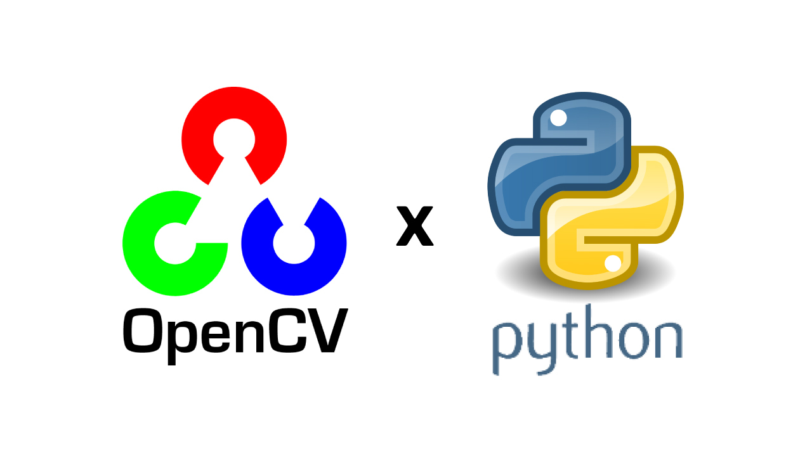
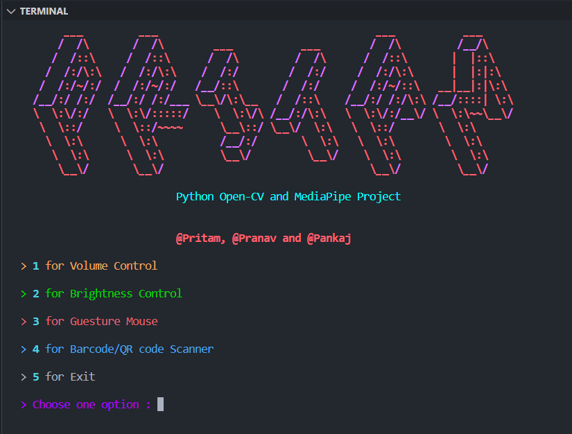

# OpenCV Tools :

<p align="center">

</p>

<p align="center">
 OpenCV Tools : OpenCv Tools based on mediapipe library.
</p>

<!-- ### Pritam Available on : -->

## Installation

Clone the github repo

```
$ git clone https://github.com/developer-pritam/opencv-tools.get
```

Change Directory

```
$ cd opencv-tools
```

### Requirements :

For requirements run following commands:

```
$ python3 -m pip install -r requirements.txt
```

OR

```
$ python -m pip install -r requirements.txt
```


## Features / Tools

- Volume Controller with Hand Guesture
- Brightness Controller with Hand Guesture
- Mouse Controller with Hand Guesture
- QR Code Scanner


## Tech Stack
- Python
- OpenCV
- Media Pipe


## Usage :

<p align="center">

</p>


### Basic Usage:

Select from the given options give by entering the respective number (`eg. 1, 2, 3, 4, 5`). 

```
~/pritam$ python main.py
help :  -h for listing all the commands
```


## Available Commands :

```
ls: Display all pritam Commands
help: For Help
quit: For quiting the program
clear: For cleaning your terminal screen
exit: For exiting from Pritam
main: Go to main menu
back: Back to mmain menu
```

## Support
For support, email developerpritam@gmail.com.


## Contribution :

Every pull request with good and understandable code :) is welcomed.
